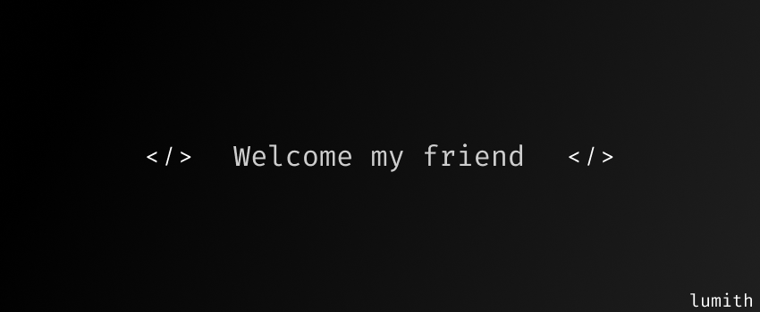

<!-- ВЕРХНИЙ БЛОК: Главный баннер и кнопки в одной таблице -->
<table width="850" border="0" cellpadding="0" cellspacing="0" align="center">
  <tr>
    <td colspan="3" align="center">
      
        
    </td>
  </tr>
  <tr>
    <td width="415">
      
    </td>
    <td width="20"></td> <!-- Отступ между кнопками -->
    <td width="415">
      
    </td>
  </tr>
  <tr><td height="15" colspan="3"></td></tr> <!-- Отступ между рядами кнопок -->
  <tr>
    <td width="415">
      
    </td>
    <td width="20"></td>
    <td width="415">
      
    </td>
  </tr>
</table>

  

<!-- НИЖНИЙ БЛОК: Информация и Гифка (ширина 850px) -->
<table width="850" border="0" cellpadding="0" cellspacing="0" align="center">
  <tr>
    <!-- Левая колонка: Описание -->
    <td width="415" valign="top">
      <h2>Hey, I'm Lumith 👋</h2>
      

        Just a guy breaking things in tech and science. I find pretty much everything in these fields interesting, especially <b>math</b>. 
      

      

        My absolute weapon of choice is <b>C++</b> — mostly because solving competitive programming problems is my twisted way of relaxing. I'm also currently messing around with <b>Flutter and Dart</b> to actually build something cool.
      

      

        When compiler errors inevitably ruin my day, I just escape to <b>Minecraft</b> or blunder my queen on Chess.com (still a complete beginner, so no judgment).
      

       
      
    </td>
    <!-- Разделитель колонок -->
    <td width="20"></td>
    <!-- Правая колонка: Гифка по центру -->
    <td width="415" align="center" valign="middle">
      
    </td>
  </tr>
</table>
